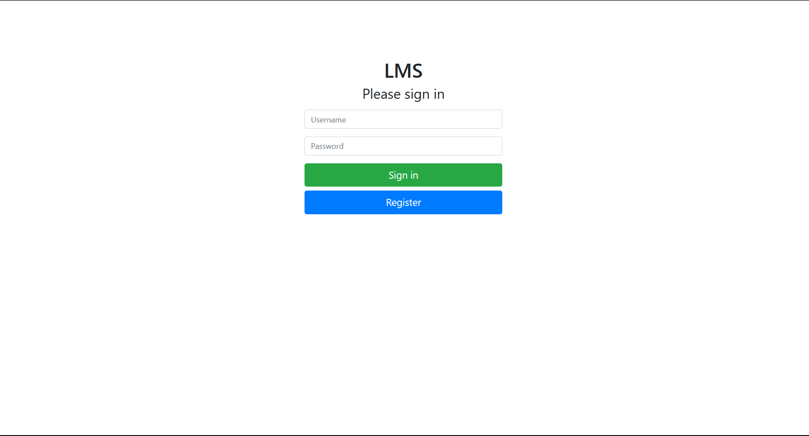
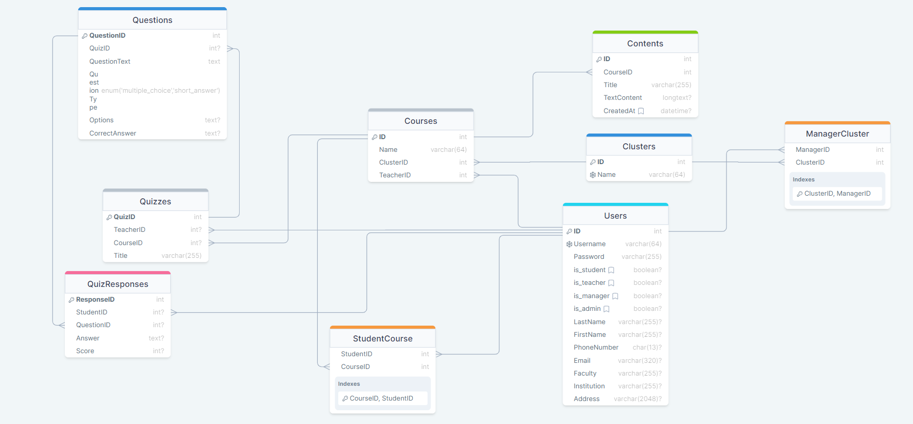

# Learning Management System
LMS is an online learning management system that integrates Generative AI technology and is designed to manage teaching and learning activities for teachers and students.  
LMS is a basic web application created using Python Flask, HTML, CSS, JavaScript, and MySQL.

## Table of Contents
* [Introduction](#introduction)
* [Prerequisites](#prerequisites)
* [Deployment Steps](#deployment-steps)
* [Database Schema](#database-schema)
* [Usage](#usage)
* [Project Status](#project-status)
* [Room for Improvement](#room-for-improvement)
* [Acknowledgements](#acknowledgements)
* [Contact](#contact)
<!-- * [License](#license) -->


## Introduction
The LMS (Learning Management System) is a project developed by the ChatJLPT team for the Microsoft Azure OpenAI Hackathon 2024. This system is designed to enhance online learning for students and improve the management capabilities of teachers in educational institutions and organizations. The LMS integrates a language generation model provided by OpenAI to facilitate interactive and personalized learning experiences.  
- Demo

<!-- You don't have to answer all the questions - just the ones relevant to your project. -->


## Prerequisites
- Python 3.6 or later
- Flask - version 1.1.2
- HTML
- CSS
- JavaScript
- MySQL
- API ChatGPT from OpenAI

## Deployment Steps
### Step 1: Set Up Database

- Set up MySQL from [MySQL8.0](https://dev.mysql.com/downloads/mysql/)
  
- Create database:
  
  ```CREATE DATABASE database name;```

- Create tables: In file `Azure_lms/mydb.sql`

- Set up the variables for connecting to the database:

  - Create a `local_settings.py` file inside the `Azure_lms/app` directory
  - Fill in the file with the following information:

   ```
   MYSQL_HOST = 'hostname or IP address of database server here'
   MYSQL_USER = 'username here'
   MYSQL_PASSWORD = 'your password here'
   MYSQL_DB = 'database name here'
   ```
### Step 2: Configure Environment Variables

- You should set 4 environment variables

  - In GNU/Linux or macOS:
  ```
  export FLASK_APP=main.py
  export FLASK_DEBUG=1
  export AZURE_OPENAI_ENDPOINT='Your Azure OpenAI resource's endpoint value.'
  export AZURE_OPENAI_KEY='Your Azure OpenAI resource's key'
  ```
  - In windows:
  ```
  set FLASK_APP=main.py
  set FLASK_DEBUG=1
  set AZURE_OPENAI_ENDPOINT='Your Azure OpenAI resource's endpoint value.'
  set AZURE_OPENAI_KEY='Your Azure OpenAI resource's key'
  ```
  - `FLASK_APP` is the name of the flask app file, and `FLASK_DEBUG` should be 0 or 1, if it's 1 we have access to hot reload and some more features in development phase.  
### Step 3: Install Dependencies

- For running this on your computer first make sure you have `python3.6` or later, then install `virtualenv` package.
  ```
  pip install virtualenv
  ```
- Create a virtual environment in main directory of the project (in folder Azure_lms) preferably with a name like `venv`, `env`, `.venv` or `.env` so`.gitignore` file can ignore it without any modification,  assumed you're gonna use `.venv`.
  
  ```
  virtualenv .venv
  ```
- Activate your virtual environment in MacOS/Linux:
  ```
  source .venv/bin/activate
  ```
- Or if you're still using windows:
  ```
  .\venv\Scripts\activate
  ```
- Then install all of the project's dependencies without affecting anything on your computer.
  ```
  pip install -r requirements.txt
  ```
### Step 4: Start the Application

- In the app directory run the server with this command in MacOS/Linux:
  ```
  flask run
  ```
- Or Windows run file `main.py`

## Database Schema
  

## Usage
- Admin haves the authority to add clusters, courses, managers, and students to a course.
- Manager haves the authority to add courses to a cluster and add students to a course.
- Teacher haves the authority to add content and quizzes, as well as manage students in a course.
- Students can participate in discussions and quizzes, as well as use ChatGPT to grade quizzes and explain assignments.
  
## Project Status
- Project is: _in progress_. 


## Room for Improvement

Room for improvement:
- Improvement to be done 1
- Improvement to be done 2

To do:
- Feature to be added 1
- Feature to be added 2


## Acknowledgements
- This project was inspired by [lms](https://github.com/SMMousaviSP/lms) and [chatbot](https://www.youtube.com/watch?v=70H_7C0kMbI&t=15s)
- This project was based on [flask tutorial](https://flask.palletsprojects.com/en/3.0.x/?fbclid=IwAR2aVhoDH_Pr8lfyGJMdBFe5tIv5df86pTatYoS89xbA_-HfaWy4KVsrAc8).
- Many thanks to Sun Asterisk and Microsoft.


## Contact


<!-- Optional -->
<!-- ## License -->
<!-- This project is open source and available under the [... License](). -->

<!-- You don't have to include all sections - just the one's relevant to your project -->
